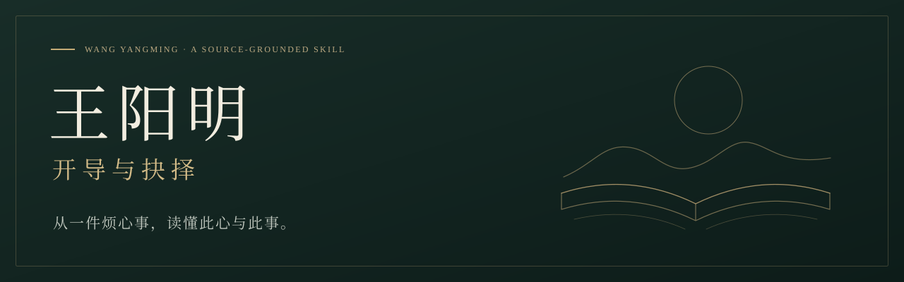

<p align="center">
  
</p>

<p align="center">
  <strong>把烦心事说具体，把下一步看清楚。</strong><br>
  一份依据王阳明原典、以现代汉语回应生活困惑的开放 Skill。
</p>

<p align="center">
  <a href="#start">开始使用</a> ·
  <a href="#conversation">看看回答</a> ·
  <a href="#sources">了解资料</a> ·
  <a href="#verification">查看验证</a> ·
  <a href="#faq">常见问题</a>
</p>

<table align="center">
  <tr>
    <td align="center" width="25%"><h3>52</h3>去重原典单元</td>
    <td align="center" width="25%"><h3>8</h3>思想与教法主题</td>
    <td align="center" width="25%"><h3>2.4 万</h3>原典字符</td>
    <td align="center" width="25%"><h3>v4.0</h3>当前版本</td>
  </tr>
</table>

<br>

遇到一个过不去的坎，人有时需要先分清：到底发生了什么，哪些是自己额外加上的要求，什么责任仍然要承担，下一步又能怎样做。

本项目把《传习录》、王氏书信与《大学问》中的判断方法整理成可读取、可核对的材料，让 AI 像一位长期研读阳明的长者，贴着你的具体处境说话。**先回应你的事，讲清一个关键区别，再给一个优先可做的行动。**

你可以带来工作、关系、自责、失落和人生选择。它追求的是让人看得更明白、逐渐站得住；帮助是否成立，要由具体的人和实际生活来检验。

---

<a id="start"></a>

## 01 · 从这里开始

### 用豆包或其他 AI 聊天

**准备一个附件，再说你的事。**普通使用不需要编程，也不需要重新提供八本书。

| 步骤 | 你要做什么 |
| :--- | :--- |
| **① 获取材料** | 下载 [完整指南.txt](prompts/完整指南.txt)，添加到**这一次聊天**的附件中。 |
| **② 告诉它怎么聊** | 复制 [启动提示词.txt](prompts/启动提示词.txt)，或使用下面这段开场。 |
| **③ 说出具体困惑** | 讲清发生了什么、你最难受或最难决定的地方。只说愿意说的部分即可。 |

```text
请读取我上传的《王阳明：完整指南 v4.0》，按其中的方式与我交谈。
先结合我的事，读取相关主题和完整原典，再回答。
古人部分标“白话转述”，现代建议另说，古文和出处放在文末。
一次讲清一个核心区别，给一个优先能做的行动。
如果没读到需要的原段，请直说。

我眼下想谈的是：
【把你的具体处境写在这里】
```

完整附件约 **9.4 万字符**，已经合并核心规则、八个主题和全部原典单元。支持长文本的平台，也可粘贴 [直接开始.txt](prompts/直接开始.txt) 全文。短启动提示词需要配合完整材料。

> **豆包使用说明**
> 文件需要进入当次对话，并被模型实际读取。放进云盘存储不会自动加载。豆包具体账号的附件读取、云电脑技能导入和运行效果尚未实机验证；详见 [平台状态](docs/platform-support.md)。

### 用支持文件夹 Skill 的工具

获取 [完整仓库 ZIP](https://github.com/3105059695-rgb/wang-yangming-skill/archive/refs/heads/main.zip)，或克隆仓库：

```bash
git clone https://github.com/3105059695-rgb/wang-yangming-skill.git
```

按所用工具的安装方式导入完整目录，以 [SKILL.md](SKILL.md) 为入口。保留 `references/` 等随附文件：它先读思想全体，再按问题选择主题与完整原段；已经读到、仍在上下文中的内容可以沿用。

**[详细使用说明 →](docs/usage.md)**　**[保存记录、下次接着聊 →](docs/memory.md)**

---

<a id="conversation"></a>

## 02 · 先看看，它会怎样回应

下面节选自 v4 的一次**合成情境实际试答**，保留原答文字。它展示回答方式，不是真实使用者的评价。

**来者的困惑**

> 我在转行学数据分析，三个月刷完了很多课，项目却总做错。我老师说知行合一，既然没做好，就说明我根本不是真想学。我现在连查资料都觉得是在逃避，只好硬做，结果同一类错反复犯。是不是我确实没立志？

**回答节选**

不能凭项目做错，就断定你没有立志。按你说的，老师这句话已经让你把必要的求知也当成了过错，结果越硬做，越没有机会弄清为什么错。这个做法需要调整。

**白话转述（节选）：**顾东桥在信中强调，要通过学习、发问、思考、辨别来明理，免于任意行事。阳明回应：学写字，本来就要铺纸执笔；学中遇到疑惑便发问，发问本身也是学习、实行，思考和辨别也是如此。这几样各有作用，却是在完成同一件事，不能把它们与实行截成两段。

放到你这里，查资料是不是逃避，要看它怎样接回项目。为了弄清一个具体错误，找到解释再回来验证，是在学；一直换课、收藏资料，却始终不碰那个错误，才有必要检查是不是在绕开困难。你先前刷过很多课，能说明接触过知识，还不能说明已经能独立运用。现在禁止自己查问，也补不上这个缺口。

<details>
<summary><strong>继续读：它建议先做什么？后来又怎样改判？</strong></summary>

眼下先只改透最近反复犯的一类错：留下一次出错的过程，写清预期是什么、实际是什么，带着这个差别查资料或请老师指出错在何处，再回到原项目重做；换一个同类小例子，看看能否自己解释并做对。若仍错，就继续定位哪一步没明白，不加一句“我果然不够想学”。

你愿不愿意学，与目前能做到什么程度，需要分别看。把不懂处认出来、把一种错弄明白，就是今天可以落实的方向。你不必先证明自己足够坚定，才有资格请教。

**原文与出处**

> 蓋學之不能以無疑，則有問，問即學也，即行也；又不能無疑，則有思，思即學也，即行也；又不能無疑，則有辨，辨即學也，即行也。

[《传习录》卷中第136条，《答顾东桥书》](https://zh.wikisource.org/w/index.php?title=%E5%82%B3%E7%BF%92%E9%8C%84/%E5%8D%B7%E4%B8%AD&oldid=2509125#136)。条号据本包采用的公开转录。

**来者随后补充：**其实已经能改对，只是害怕被评价，所以一再买课、推迟提交。

**实际续答节选：**

> 这就要修正我刚才的判断了：你已找出错误并能改正，眼前卡住的主要是提交后的评价，再买课没有对准这个问题。老师若是在指出你借买课拖延提交，这一处批评值得听；但“有这处回避”仍推不出“根本不想学”。

完整对话及后续行动见 [未经改写的试答](docs/v4-dialogues.md)。这里省略了续答后半段，没有把几次回答拼成一次输出。

</details>

<br>

**还有这些问题，可以直接带来聊：**

| 你正在经历 | 可以这样开口 |
| :--- | :--- |
| 总拿自己与别人比较 | “朋友做得比我好，我甚至盼他失败。我该怎么看待这种嫉妒？” |
| 反省越来越重 | “做什么都怀疑自己有私心，连说一句祝福都不自然了。” |
| 关系里很难拒绝 | “父母为我付出很多，我选择不同的路，是不是没良心？” |
| 道歉以后仍放不下 | “能补救的已经补了，但一想到那件事就不允许自己好好生活。” |
| 面临实际选择 | “我想换工作，但有存款和家庭责任的限制，帮我把几条路看清。” |

**[读 7 次 v4 原样试答 →](docs/v4-dialogues.md)**　**[看 20 道编辑示范 →](examples/20-life-questions.md)**

---

## 03 · 一次回答，怎样才算用上了原典

**有具体处境。**开头接住眼前的问题，分清已知事实和推测。不同的“做不到”，可能缺行动，也可能缺知识、方法、精力或支持。

**有真正起作用的分别。**读原问、原答和必要条件，说清它改变了哪一条判断。古人的故事和名句，应当帮助读者认清自己的事。

**有清楚的文字边界。**古人部分标“白话转述”，保留原有问题与回答；只有劝告就用叙述。现代案例与建议另说，古文和出处集中在文末。

**有可以改变的建议。**事实足够时给明确主张，说明眼下能做的一件事。新条件出现后重新判断，已经做过的事不反复布置，仍有情绪也不自动算作失败。

这些要求写进 [核心 Skill](SKILL.md)。身体、钱、时间和权力关系都属于真实条件；开导需要把它们看进去。

---

<a id="sources"></a>

## 04 · 资料库里，究竟有什么

### 八个主题，把思想之间的关系接起来

| 主题 | 主要帮助分清什么 | 阅读 |
| :--- | :--- | :--- |
| **思想全体** | 明德、亲民、至善，与格致诚正怎样落在同一件事中 | [进入](references/topics/system.md) |
| **心即理与诚意** | 善意与实际做法，真诚与自我辩护 | [进入](references/topics/foundations.md) |
| **知行与求知** | 何时该实行，何时该问、学、思、辨 | [进入](references/topics/knowing.md) |
| **情绪与动静** | 有情绪与被情绪牵走，省察与过度监视自己 | [进入](references/topics/emotions.md) |
| **立志与教学** | 守住方向、循序成长，与过量催逼的区别 | [进入](references/topics/cultivation.md) |
| **关系与共同责任** | 关怀与包办，共同成事与各尽所能 | [进入](references/topics/relationships.md) |
| **教法与语气** | 怎样追问、解释、劝勉、承认未知和修正建议 | [进入](references/topics/voice.md) |
| **历史与书证** | 思想如何发展，语录、书信与文学加工怎样区分 | [进入](references/topics/history.md) |

八篇原创主题分析约 **1.1 万汉字**。每个原典单元另附：**原问处境、完整原文、判断用途、反用条件、语气说明与对读定位**。

### 52 个单元，逐条可以核对

| 来源 | 单元数 | 收录范围 |
| :--- | ---: | :--- |
| 《传习录》卷上 | 18 | 完整编号单元 |
| 《传习录》卷中 | 9 | 书信中的完整编号分段 |
| 《传习录》卷下 | 24 | 完整编号单元 |
| 《大学问》 | 1 | 全篇六组问答，记录者后跋另标 |

原文合计 **24,166 字符**，含标点和段间换行。《大学问》六问只计一篇；书信分段不冒称整封书信，整个资料库也不等于阳明全集。

**[打开全部原典目录 →](references/library-index.md)**　**[查看 v4 补深内容 →](docs/deepening.md)**

<details>
<summary><strong>展开研究书目：八份材料怎样进入这份 Skill？</strong></summary>

| 研究材料 | 在项目中的主要作用 |
| :--- | :--- |
| 王觉仁《王阳明心学》 | 大众问题的切口、原典引录与现代改写的辨别 |
| 杨嵘编著《王阳明大全集》 | 语录与书信的原文对读、概念关系核查 |
| 冈田武彦《王阳明大传》 | 思想发展、教法变化、书信线索和不同史料的比较 |
| 赵柏田《王阳明：让良知自由》 | 附录书信与生活条件；文学叙述另作区分 |
| 许葆云《王阳明：全三册》 | 长程情境与现代设计启发，小说对白不作历史实录 |
| 周明河《千古大儒：王阳明》 | 生平线索、文本加工与杜撰对白的识别 |
| 迟双明《传习录全鉴》 | 原问、原答、译释与条件的对读 |
| 陆东风《传习录：一本书读懂阳明心学》 | 原典定位、不同译释和文字疑点的核查 |

研究工程保存了 **381 个连续阅读块**的记录。它证明覆盖记录存在，不能认证理解已经充分；现代书籍之间有重复原文，也有后人的分析与文学加工。

公开仓库提供固定公开版本的古文和本项目的原创说明。八本现代图书的原始 PDF、MOBI、EPUB 留在私有研究工程中。《大学问》是另行补充的公开原典，不算上传的第九本书。

[逐书贡献与实际核对定位](docs/book-contributions-v4.md) · [阅读记录及已知例外](docs/reading.md)

</details>

---

<a id="verification"></a>

## 05 · 做过哪些验证，还有哪些未知

v4 在 **4 个新上下文中完成了 7 次实际答复**：三组两轮对话，一组完整附件首答。情境是合成的，输出原样保存，执行者在首轮时看不到后续转折。

| 试答情境 | 实际观察 |
| :--- | :--- |
| 合作中的嫉妒 → 合伙人擅改收入分配 | 从辨明嫉妒转向维护原约，算清双方各相差 1,500 元 |
| 项目总做错 → 实际已会做，只怕提交 | 从补知识转向提交成果，明确修正先前判断 |
| 过度检查私心 → 承认自己确实说了谎 | 允许减少自我审查，同时要求更正具体谎话 |
| 父母要求回乡 → 自己希望留城 | 完整附件实际读完后，区分感激与听从一项安排，保留照护条件 |

本地检查覆盖了生成文件一致性、来源文字、历史测试输入与文件链接。**这些检查和试答仍不能证明模型已经完整掌握阳明思想，也不能证明真实助人效果。**

已知的一处引文末尾标点偏差仍保留在原答中。豆包实机、跨模型稳定性、长期使用效果，以及是否足够自然、是否让人有所松动，都需要进一步验证。

**[原样试答与问题记录 →](docs/v4-dialogues.md)**　**[查看来源核对结果 →](evals/v4-source-checks.json)**

---

<a id="faq"></a>

## 06 · 你可能还想知道

<details>
<summary><strong>这是训练了一个“王阳明模型”吗？</strong></summary>

答案仍由你所用平台的大模型生成。Skill 将原典、主题分析、判断规则与语气要求放进它能读取的材料中，约束这次回答；本项目没有重新训练模型权重。这是依据文献的现代重建。

</details>

<details>
<summary><strong>文件这么长，每次都要从头读吗？</strong></summary>

文件夹入口按问题读取主题与相关原段，同一上下文中已经读到的内容可以沿用。完整附件让普通聊天一次带走全部材料；是否完整索引、怎样检索和响应速度，取决于实际平台。当前没有豆包速度实测数据。

</details>

<details>
<summary><strong>为什么有时劝行动，有时又劝停下来？</strong></summary>

指点要对着具体处境。反复空想与缺少必要知识需要不同帮助；反省过重与确有错误尚未改正也不相同。每个主题都说明适用、反用和停用条件。现实条件改变后，建议应当跟着改变。

</details>

<details>
<summary><strong>它能记住我的经历，下次继续聊吗？</strong></summary>

可以使用 [个人记录模板](templates/我的记录.md)，保存本人确认过的背景、选择和实际进展。下次把最新版记录与指南一起提供。文件是否真正写入、平台是否有持久记忆，要分别核实；只整理出一段文字不能声称已经保存。

</details>

<details>
<summary><strong>我可以修改、分享，或者做成自己的版本吗？</strong></summary>

可以。本项目原创指令、分析、示范和脚本采用 [MIT License](LICENSE)，使用和再分发时保留许可。公版古文保留来源与版本信息，第三方现代图书不在这份许可的重新授权范围内。详见 [来源与使用授权](docs/credits.md)。

</details>

---

## 07 · 深入阅读与参与改进

| 你想做什么 | 去哪里 |
| :--- | :--- |
| 理解 Skill 怎样构造、怎样形成判断 | [构造与解题方式](docs/how-it-works.md) |
| 查看八本书的贡献、依据和不足 | [逐书材料说明](docs/book-contributions-v4.md) |
| 对比 v4 与旧版的变化 | [补深说明](docs/deepening.md) · [版本记录](CHANGELOG.md) |
| 核对旧版测试，区分历史表现 | [历史测试记录](docs/evaluation.md) |
| 报告原文错误、误用或不自然的回答 | [提交 Issue](https://github.com/3105059695-rgb/wang-yangming-skill/issues) |

最有帮助的反馈，是一段具体的问题与回答，以及你觉得哪里没说中：原意变了，忽略了现实条件，还是语气依然像说教。能够回到原段和实际处境，才有办法继续改。

<details>
<summary><strong>给维护者：目录与构建方式</strong></summary>

```text
wang-yangming-skill/
├── SKILL.md                  对话、判断与表达的核心规则
├── prompts/                  普通聊天的完整附件与启动提示词
├── references/
│   ├── library-index.md      资料选择入口
│   ├── library.json          52 个原典单元的结构化来源
│   ├── topics/               八篇主题分析
│   └── units/                可单独读取的完整原段与说明
├── examples/                 经编辑的情境示范
├── evals/                    原样试答、历史输入与核对记录
├── templates/                个人记录模板
├── docs/                     使用、研究、构造与验证说明
└── scripts/                  构建与检查脚本
```

修改核心规则、主题或 `references/library.json` 后，用 Python 3 运行：

```bash
python scripts/build.py
python scripts/validate.py
```

脚本只用标准库。新增原典需要明确版本、处境和反用条件；已发生的试答保留原样，修订示范与实际测试分别记录。

</details>

<br>

<p align="center">
  <strong>从你眼下这一件事，慢慢看清。</strong><br>
  <sub>Wang Yangming · 开导与抉择 · v4.0 · MIT</sub>
</p>
