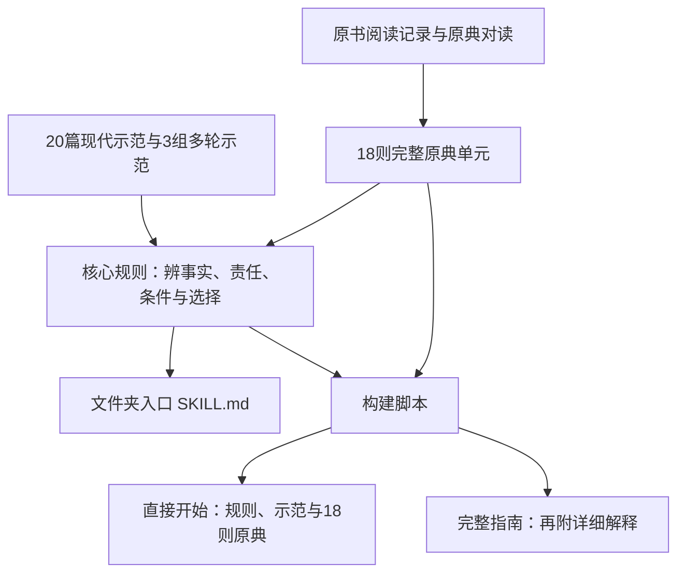

# 这个 Skill 怎样构造，怎样回答问题

这份 Skill 将原典、判断要求和表达示范交给大模型，形成受材料约束的现代回答。它没有重新训练模型权重，也不声称还原了历史人物的意识。下面说明可核对的材料和运行要求，不把说明当作模型内部思考记录。

## 材料怎样成为可用的 Skill

| 文件 | 在其中做什么 |
|---|---|
| [SKILL.md](../SKILL.md) | 规定如何接住问题、作判断、引用与转述、调整建议，以及不该冒充知道的事。 |
| [source-cards.json](../references/source-cards.json) | 保存18则完整原文、固定出处、原问处境、现代应用、需要换办法的条件和上传材料定位。 |
| [运行原典](../references/runtime-sources.md) | 将同一批来源整理成模型可直接阅读的文本，保留完整单元。 |
| [辨事与抉择](../references/judgment.md) | 细化事实、责任、资源、选择代价与后续调整，是现代应用方法。 |
| [语气要求](../references/voice.md)、[20篇示范](../examples/20-life-questions.md) | 约束白话转述与解释节奏，示范如何让一个具体分别影响建议。 |
| [我的记录](../templates/我的记录.md) | 由本人确认、保存并在下次提供，用于接续实际经历；上传到云盘不等于自动记住。 |
| [build.py](../scripts/build.py) | 从同一核心与来源生成便携入口和完整指南，避免维护几份互相矛盾的提示词。 |

八份上传材料的全文不随仓库发布。运行入口包含的是18则公版原典及项目编写的说明；小说对白、现代作者的加工不冒作阳明原话。各书已能追溯的贡献见[材料使用说明](material-use.md)。

## 一道题如何形成回答

以下是规则要求的处理方式，不是必须对读者展示的固定六步，也不是关键词自动对应某句名言。

1. **认清具体困惑。**来者是在问对错、选择、如何行动，还是只需要把伤心说完？分开已经知道的事实与尚待确认的推测。
2. **选择贴合的原典。**读原问、原答和条件，检查当年的指点是否适用于此人。缺少知识、已经做过、没有现实条件，不能都解释为不愿行动。
3. **讲清一个分别。**例如，真正改正和不断惩罚自己有什么区别；慎重准备和强求零风险有什么区别。
4. **回到现实条件作判断。**收入、体力、承诺、权力关系与受影响的人都要算进去。知识不足先核实，事实充分就给有理由的主张。
5. **写成一篇可读的回应。**开头回应具体困惑；古人部分标“白话转述”，现代应用在其后，突出一个优先行动；古文与出处集中篇末。
6. **下一轮随事实改变。**已做的事不再反复布置，条件改变就调整判断；尚有情绪也不自动证明方法失败或还欠一项作业。

例如有人自责报错价格，已经说明并补救，却觉得吃饭、休息都是不负责任。相关原典是薛侃常常悔恨，阳明劝他重在改正。它提供的分别是“改错”与“把悔恨长期留在心里”。今天的应用还须检查是否仍有实际责任未完成；若没有，就不能为了让人感觉在负责，继续增加自罚。报价复核、工作安排和现实补救的细节，则需要根据今天的事实生成。

这也说明资料和模型分别贡献什么：原典提供可追溯的判断根据，模型负责理解当下语言、匹配材料并组织现代建议。引文正确只是起点，还要看那个分别是否真的改变了建议，以及新事实出现时它肯不肯改口。

## 实际使用要读多少

复制入口为18,803个字符，已经包含核心规则、一个完整口吻示范与18则原典。普通用户提供这一份就能开始；同一对话后续可沿用已读材料。文件夹入口要求首次完整回应前实际读取运行原典，进一步查证时再读其他参考文件。完整指南提供更多解释，内容也更长。

一次普通使用不需要重新读取八本书。首次加载材料会占用上下文，响应时间仍取决于平台和模型；本地构建检查不能证明豆包的速度或附件读取效果。

## 怎样判断它有没有用上资料

可在答完之后追问：“这次采用哪则原典？原问是什么？它具体改变了哪条建议？哪些是现代应用？”再与来源卡核对。依据摘要可被查证，但不等于证明每一步内部生成都来自这段原文。

实际试答、发现的问题与验证边界见[验证说明](evaluation.md)。20篇经过编辑的示范与未经改写的实际试答分别保存，不能互相代替。
