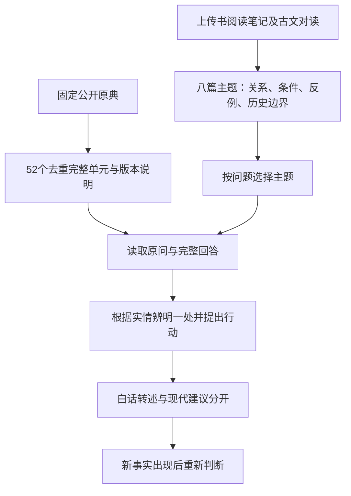

# 这个 Skill 怎样构造，怎样回答问题

v4把读书所得整理为八篇相互关联的主题，再把主题接到52个完整原典单元。关键改变是把求知、情绪、教学与共同责任之间的联系放进实际读取流程；不是仅在提示词里增加“更像王阳明”。

| 层次 | 文件与作用 |
|---|---|
| 核心规则 | [SKILL.md](../SKILL.md)：接住问题、给条件明确的判断、白话与引用规则、现代底线。 |
| 选择材料 | [资料入口](../references/library-index.md)：把问题引向主题，附全部原段链接。 |
| 思想与方法 | `references/topics/`：八篇原创综合，说明概念联系、反用条件与现代取舍。 |
| 原证 | [library.json](../references/library.json)及`references/units/`：同一批52个原段、解释、上传书定位与异文。 |
| 现实判断 | [judgment.md](../references/judgment.md)：核事实、责任、预算、可行路与改变主意的条件，是现代应用。 |
| 普通平台 | [完整指南](../prompts/完整指南.txt)：把规则、所有主题与原段合为一份附件；[短启动提示词](../prompts/启动提示词.txt)与其配合。 |

## 一道题为什么会这样答

先判断来者要解决什么，分清已知实情和自己的推测，再读与这种困处相关的主题。原典既提供一个区别，也约束用法：不能把原来对空想者说的话，用来逼缺知识的人盲动。选中的区别要能改变当下建议，否则可能只是贴名言。

例如来者学项目总做错，被说成“不是真想学”，知道的现实是反复出错，还不能据此断定他缺志。知行主题同时包含补知和补行；卷中第136条把问、思、辨纳入实践。由此可以把求教与逃避分清，再围绕一处具体错误决定下一步。查资料、练习安排属于今天的方案，不冒作古人的原话。

若用户后来补充“其实会了，只是一直另买课拖延交付”，则该重新看原来的缺口。材料的价值不在永远给同一种宽慰，而在条件变化后仍能合理改判。答复对用户只讲一处，不展示整套分类、所有原段或分析清单。

## 深度与速度怎样兼顾

原生文件夹按主题读；首次读思想全体，其后沿用仍可见的内容。完整附件入口约9.4万字符，便于普通平台一次提供全库，但是否完整索引、长度上限及响应时间取决于平台。当前没有测量豆包速度，不能保证附件和原生读取速度相同。

研究时读过、运行时读到、回答应用得当、本人真有帮助，是四件需要分别验证的事。引用和依据摘要可核对，却不是模型内部因果过程的证明。新试答见[v4原样对话](v4-dialogues.md)，未完成的范围见[补深说明](deepening.md)。
